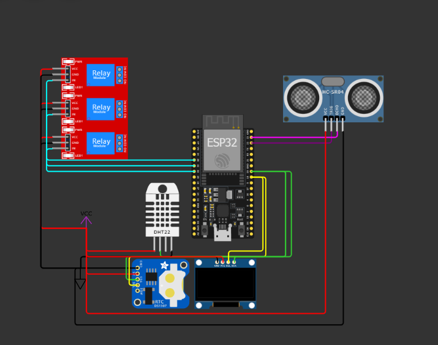

# EasyPlantV

## เข้าชมโมเดลระบบได้ที่ลิ้งด้านล่าง
<a href="https://wokwi.com/projects/385159857817988097">คลิกที่นี้</a>

## ไลบรารี้ที่ใช้ในบอร์ดนี้:
        DHT sensor library
        RTClib
        Adafruit SSD1306
        AsyncDelay

## อุปกรณ์ที่นำมาใช้
        1.ESP-32-devkit
        2.DHT22
        3.Ultrasonic sensorrelay 3-4 ตัวตามที่ต้องการนำมาใช้
        4.RTC โมดูลจับเวลา

## ความสามารถ
        สารมารถตรวจวันค่าความชื้น อุณหภูมิ และน้ำในถังว่าเต็มรึยังแบบเรียลไทม์
        ใช้ในการตรวจสอบดูแลเรือนเพาะปลูกพืชต่างๆนำไปประยุกต์ได้หลายรูปแบบ จะใช้กับโรงเพาเห็ดกระบองเพชรหรือพืชต่างๆได้ไม่ยุ่งยาก
        สามารถเพิ่มระบบการทำงานได้สะดวกเพียงแก้ไขโค้ดตามคอมเม้นและเพิ่มอุปกรณ์

